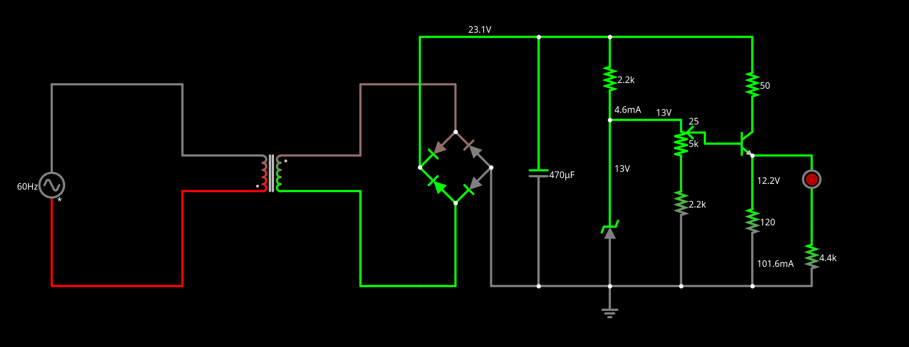
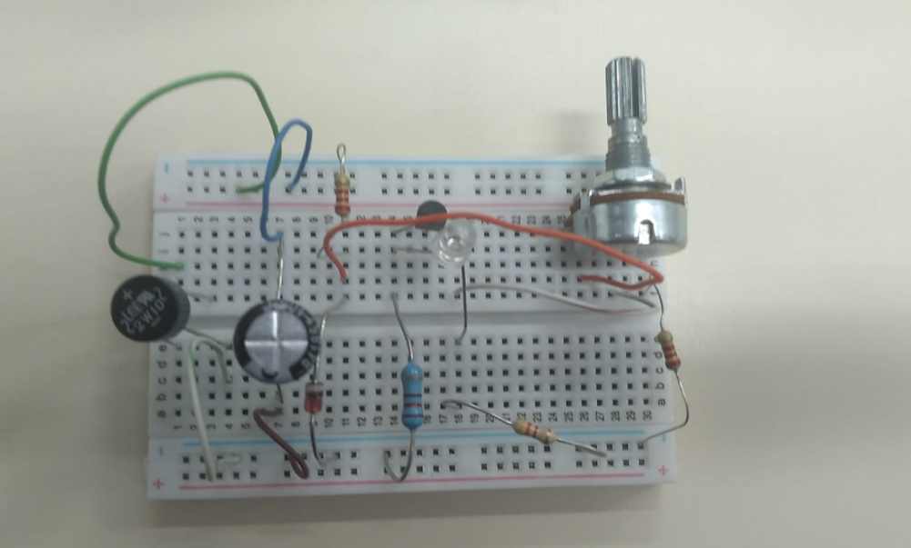
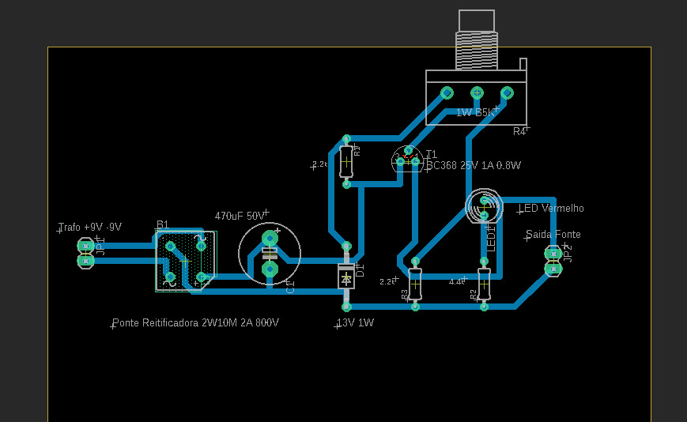

# SSC0180-Eletronica
# Fonte de Tensão Ajustável
## Definição
Montar uma fonte de tensão ajustável de 3V a 12V, com capacidade (corrente) de 100mA.
Ela receberá 127V, com uma corrente alternada de 60Hz.
## Componentes
| Quantidade      | Componente              | Valor   |
| --------------- | ----------------------- | ------- |
| 1x              | Ponte Reitificadora 2A  | R$3,78  |
| 1x              | Capacacitor 470UF 50V   | R$4,27  |
| 5x              | Resistor 2K2            | R$0,07  |
| 5x              | Resistor 4K3            | R$0,07  |
| 5x              | Resistor 1K8            | R$0,07  |
| 1x              | Resistor 50 1W          | R$0,39  |
| 1x              | Diodo Zener 13V 1W      | R$0,49  |
| 1x              | LED Vermelho            | R$1,26  |
| 1x              | Transistor BC368 25V 1A | R$0,43  |
| 1x              | Potenciômetro 1W 5K     | R$6,74  |
| 1x              | Transformador 9V+9V     |   ---   |
| 1x              | Protoboard              | R$21,05 |
| TOTAL           |                         | R$38,62 |

- TRANSFORMADOR

   Transforma a tensão de 127V em 25.1V (foram conectados as pontas +9V e -9V do transformador, gerando uma tensão média de 18V e de pico de 25.1V (18x1.4)) por meio de indução eletromagnética.

- PONTE DE DIODO

   Transforma a corrente de ALTERNADA (f = 60Hz) para CONTÍNUA (f = 120Hz) por meio de 4 diodos.
   Um diodo permite a passagem de corrente em somente uma direção.

- CAPACITOR

   Armazena a carga proveniente da tomada, descarregando-a quando a corrente alterna. Cria o efeito ripple.

- DIODO ZENER

   Funcionamento similar ao diodo comum, mas permite a passagem de corrente até um certo ponto. Nesse caso, essa corrente corresponde a uma tensão de 13V.
   Em outras palavras: se uma tensão maior que 13V chegar no Zener, ele a limitará a 13V.

- TRANSISTOR

    Permite que a tensão no celular seja ajustada pelo potenciômetro. Nosso resistor é capaz de suportar 0.8W de potência. Para não queimá-lo, devemos adicionar um resistor de baixa resistência e alta potência antes dele (nesse caso, o resistor de 50ohms e 1W). Sua resistência deve ser baixa para não transmitir o efeito ripple para o celular.

- PONTECIÔMETRO

    Podemos pensá-lo como uma resistência ajustável. Variando-a, variamos também a tensão que passa pelo celular. Ele pode variá-la de 12V a 0V. O resistor logo em seguida dele limita essa variação de 12V para 3V. Nesse caso, nosso circuito vai de 12.34V a 2.26V.

- LED

    Tem seu brilho aumentado conforme a corrente que passa pelo celular.

## Circuito
#### Faltsad: https://tinyurl.com/ynry4pmj

#### Eagle

.jpeg "Esquemático no Eagle")

## Cálculos

## Vídeo
https://youtu.be/ODlF76heZ84

## Alunos
- Alec Campos Aoki - 15436800
- Pedro Augusto Ferraro Paffaro - 15483380
- João Pedro Castelli - 15463450
- Marcelo Martins Conti - 15474629